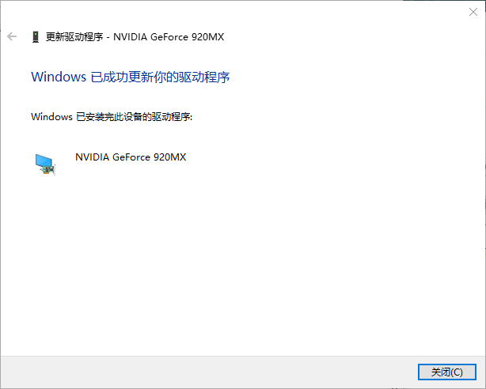
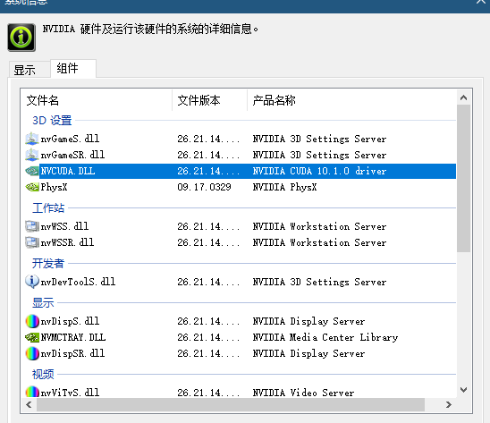
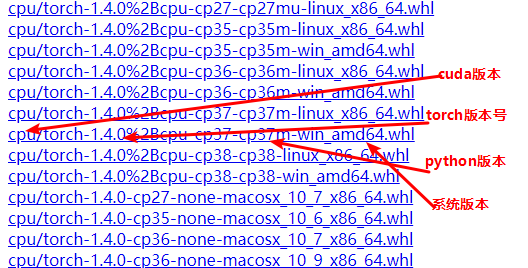

## 前言

　　最近在学习深度学习工具pytorch，响应导师号召，记录一下个中辛酸。众所周知，每当到了配置新环境环节，将是一场考验心态的入门试炼，对我而言这个过程往往痛并快乐着，虽然网上有各路前辈指路，但是由于个人PC、网络环境的不同，以及相关硬件知识的缺乏，其中也避免不了有或多或少的坑，希望通过避坑指南这个系列记录一下，并帮助也深受其苦的同胞们共度难关。


## 安装环境

　　--Win10

　　--Anaconda3-5.3.1

　　--python3.7


## 安装步骤

### 					进入 [PyTorch官网](https://pytorch.org/)，选择配置：


查看支持的CUDA版本：

　　1)鼠标右键桌面,选择NVIDIA控制面板：


　　2）选项卡的“帮助”中选择“系统信息”


　　3）查看“组件”，对应的就是你电脑GPU的CUDA版本


　　4）这里可以看到最高只支持CUDA8.0的版本，这时需要我们更新一下显卡驱动：

　　此电脑-->属性-->设备管理器-->显示适配器-->对应的NVIDIA显卡-->点击右键选择“更新驱动程序”

　　更新成功后再查看CUDA版本会发现已经适配10.0.1。






### 				 安装方式：在线pip/conda，离线pip

　　在饱受在线安装的各种坑后，个人强烈建议无梯子，对自己网络也没那么自信的朋友们选择"离线pip本地安装"的方式，不用在各种镜像源中迷失，也不用忍受下载时断时续的反复折磨，步骤如下：

　　1) 进入[Pytorch本地下载](https://download.pytorch.org/whl/torch_stable.html)，选择对应版本的torch以及torchvision下载到本地



　　2）输入pip安装命令（换成你自己的下载路径）

```
pip3 install D:\常用软件\torch-1.4.0+cpu-cp37-cp37m-win_amd64.whl
pip3 install  ‪D:\常用软件\torchvision-0.5.0+cpu-cp37-cp37m-win_amd64.whl
```


## 安装验证

　　1）打开Anaconda Prompt命令行窗口，输入 `python`；

　　2）输入`import pytorch`,无报错则表示安装成功；

​			

​		3）如果安装了CUDA版本，输入 `torch.cuda.is_available()`，若返回为true则说明GUP可以使用。


## 运行例程

　　打开Anaconda的jupyter新建python文件，运行demo：

```
	import torch
	x=torch.rand(5,3)
	print(x)
```

　　结果如下，则说明已经完全安装成功。


